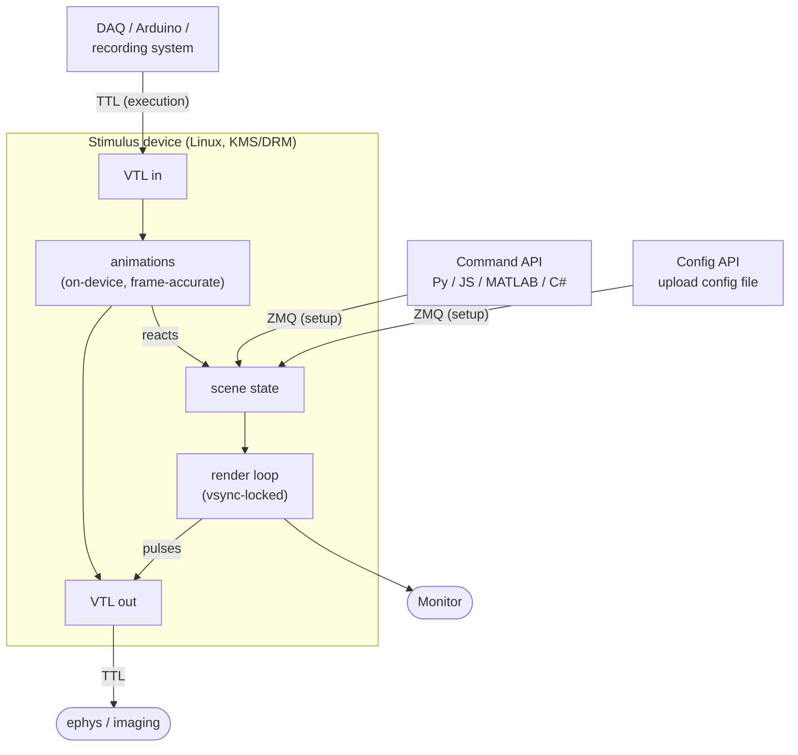

# How vstimd works: setup, then triggers

Most stimulus systems are **command-driven**: your script issues a draw call and a
frame appears, over and over, in lockstep with your code. vstimd is built the other
way round. Its centre of gravity is a **trigger-driven execution model**: you load
stimuli and small **animations** onto the device *ahead of time*, arm them against
**Virtual Trigger Lines (VTL)**, and then the device itself produces precisely-timed
visual stimulation the instant a trigger arrives — in hardware time, with no client
in the loop.

So there are two distinct activities, and the single most important thing to get right
is keeping them apart:

1. **Setup** — preparing the scene: the stimuli, and the trigger-armed animations that
   will run. This is *not* timing-critical; it happens before the trial.
2. **Execution** — the trigger-driven moment: a (virtual) trigger fires and an armed
   animation drives the display frame-accurately. This *is* the timing-critical part,
   and it runs entirely on the device.

## Setting up the scene

There are **two setup APIs**. They do the same job — populate the device with stimuli
and trigger-armed animations — and you can mix them freely.

### The command API (imperative)

A software client sends **commands** over ZMQ/protobuf, each mapping to one scene
change: *create a rectangle*, *set its position*, *create an animation armed on trigger
line 3*. It is reachable from any language that speaks protobuf/ZMQ; the maintained
clients are **Python** and **JavaScript** (the web control UI), with C# / Bonsai usable
today and a MATLAB client planned.

The command API is a **request/response** conversation — every call is a network
round-trip — which is exactly right for setup and for high-level trial structure (trial
loops, condition selection, logging). Use [deferred mode](deferred-mode.md)
to make several changes appear on the *same* frame.

It is *not* the tool for reacting to an external signal within a single frame — that
round-trip through your OS and the network is exactly the jitter you want to avoid.
That job belongs to the trigger framework below.

👉 **[The command API](command-api.md)**

### The config API (declarative)

A whole scene — stimuli, animations, background, **and** the VTL line map — can be saved
to and loaded from a **versioned JSON config file** on the device (via the command API's
`scene_config` namespace, or the web UI). A rig can boot straight into a known stimulus
configuration with **no client connected at all**. See
[Saving & loading scenes](saving-loading.md).

Both setup paths leave the device in the same state: stimuli created, animations armed
and waiting for their triggers.

## The core: trigger-driven execution (VTL)

This is what makes vstimd vstimd, and what sets it apart from purely command-driven
stimulus systems. The setup above only *prepares* the scene; nothing timing-critical has
happened yet. The precisely-timed visual stimulation is produced here, on the device, when
a trigger arrives.

- **Virtual Trigger Lines (VTL)** are a bank of trigger bits in shared memory. A companion
  daemon maps real TTL lines onto them (or a client simulates them for testing).
- **Animations** are the small declarative behaviours you armed during setup — *flash for
  N frames*, *couple visibility to a line*, *move along a path*, *flicker* — each with a
  rich vocabulary of start/final/cancel actions.

vstimd polls the input lines at the **start of every frame** and commits output lines at
vblank. So an armed animation can wait for a rising edge on an input line, flash a stimulus
for exactly 10 frames, and pulse an output marker on the frame the flash begins — all
without a single network round-trip. Because vstimd reads *and* writes lines each frame,
animations can even **chain each other entirely inside the server**.

Reach for this path — which is to say, the whole point of vstimd — when:

- the stimulation must be **frame-accurate and independent of network/OS latency**;
- you need to **emit stimulus-onset markers** to a recording system;
- you want stimulus behaviour to **react to a TTL, photodiode, or lever** directly.

👉 **[Triggers & animations](vtl-and-animations.md)**

## A trial, end to end

1. **Setup (command or config API).** Create the stimuli and an animation *armed* to fire
   on a trigger line.
2. **Execution (VTL).** A TTL from the recording system fires. On that frame vstimd flashes
   the stimulus and pulses an output marker — in hardware time.
3. **Bookkeeping (command API).** Your script queries state, logs the trial, and sets up the
   next one.

The setup APIs prepare the scene; the trigger framework runs the timing-critical moment. See
[Integrating recording systems](recording-integration.md) for how the output markers land in
your ephys/imaging clock.

## Decision guide

| You want to… | Use |
|---|---|
| Create / modify / query stimuli from your script | **Command API** (setup) |
| Run trial logic, condition selection, logging | **Command API** (setup) |
| Make several changes appear on one frame | **Command API** + [deferred mode](deferred-mode.md) |
| Boot a rig into a fixed scene with no client | **Config API** (config file) |
| Flash / move / flicker a stimulus with exact frame timing | **Animation** (VTL execution) |
| React to a TTL / photodiode / lever within a frame | **Animation armed on a VTL input line** |
| Emit a stimulus-onset marker to ephys/imaging | **Animation with an output trigger-line action** |
| Chain one reaction into another on-device | **Animations coupled via VTL output edges** |
| Port existing PsychoPy code with minimal edits | **[PsychoPy-compatible layer](command-api.md#psychopy-compatibility)** |

## Worked examples

Once the two halves make sense, **[Build the demos yourself](../tutorials/index.md)**
rebuilds each of the shipped [demo scenes](../getting-started/demos.md) from an
empty scene in an annotated Python script — setup and trigger-driven execution
in the same file, ending in a config the rig can boot into.
