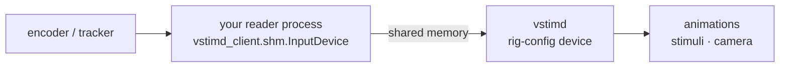

# Input devices

A running wheel, a treadmill encoder or an eye tracker can drive stimuli and the
3-D camera **every frame**, with no command per frame and no network in the path.
The device's reader is its own process; it publishes samples to shared memory,
and vstimd reads them at the start of each frame.



## 1. Publish the device

```python
from vstimd_client.shm import InputDevice, Semantic

with InputDevice.create("/vstimd_wheel", [("distance", Semantic.CUMULATIVE)]) as dev:
    total = 0
    for ticks in read_serial_wheel():
        total += ticks
        dev.write([total])
```

Each axis has a **semantic**, which decides how vstimd uses it:

| Semantic | Publish | vstimd uses | Example |
|---|---|---|---|
| `ABSOLUTE` | the current value | the value | gaze position, joystick position |
| `CUMULATIVE` | a running total, never reset | its change since last frame | wheel ticks, distance |
| `RATE` | a velocity | value × frame time | joystick deflection |

Two rules make a producer correct:

- **A cumulative axis is a running total, never a per-sample delta.** vstimd
  subtracts last frame's total, so a sample it missed is folded into the next
  frame instead of being lost.
- **Keep writing, even when nothing changes.** Every write is a heartbeat.

`client/python/examples/wheel_reader.py` is a complete reader for a serial
encoder, with a `--simulate` mode. Rust producers use the `vinput` crate, whose
layout the Python module matches byte for byte.

## 2. Declare it on the rig

Devices belong to the rig, not the experiment, so they live in the rig-config
(`/etc/braemons/vstimd-rig-config.toml`) and scripts refer to them by name:

```toml
[[input.device]]
name           = "wheel"
shm            = "/vstimd_wheel"
stale_after_ms = 100

  [[input.device.axis]]
  name     = "distance"
  semantic = "cumulative"
  scale    = 0.0127        # counts → cm
```

The axis semantics must match what the producer declares, or vstimd will not
connect. `scale` converts the producer's raw numbers into the units animations
use. vstimd connects whenever the producer appears and reconnects if it restarts.

## 3. Drive something with it

```python
from vstimd_client.animations import AxisMap, AxisRef, TransformChannel

# Walk the 3-D camera down a corridor with the wheel
walk = conn.animations.create_linear_nav_3d(
    0, source=AxisRef("wheel", "distance"), wrap_period_cm=100)

# Map axes onto any transform channel of stimuli, or of the camera (stimuli=None)
conn.animations.create_device_driven_transform(dot, "eye_tracker", [
    AxisMap("x", TransformChannel.POS_X, gain=1.0),
    AxisMap("y", TransformChannel.POS_Y, gain=1.0, clamp=(-500, 500)),
])

# Or place a stimulus at a gaze position directly
conn.animations.create_external_position_2d(dot, "eye_tracker")
```

Animations are checked against the rig when they are created: an unknown device
or axis, a movement channel (`FORWARD`, `STRAFE`) driven by an absolute axis, or a
camera channel on a stimulus is refused with an error that says which.

## When the producer stops

If a device's producer is silent for longer than `stale_after_ms`, the device is
**stale**: rate axes read zero and cumulative axes stop, so a crashed wheel reader
stops the camera instead of leaving it running. The animation keeps running, and
motion resumes when the producer does — without a jump, because a restarted
cumulative count becomes the new baseline.

A stale device is logged once, shown in the overlay's System panel, and reported
to scripts:

```python
for d in conn.system.list_input_devices():
    print(d.name, d.backend, "STALE" if d.stale else "live")
print(conn.animations.query(walk).device_stale)
```

## Without the hardware

`vstimd --input-override wheel=keyboard:30` stands the arrow keys in for the
device — Up/Down on the first axis, Right/Left on the second, at 30 units per
second — keeping its axes and scale, so the same experiment script runs on a desk.
`--input-override wheel=gamepad:0:30` does the same with the first gamepad's
sticks (left Y, left X, right X, right Y on axes 0–3), in a vstimd built with the
`gamepad` feature. The overlay shows a keyboard or gamepad backend in yellow so it
cannot be mistaken for the rig's hardware.
