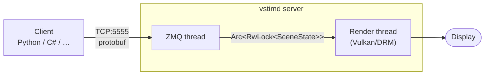
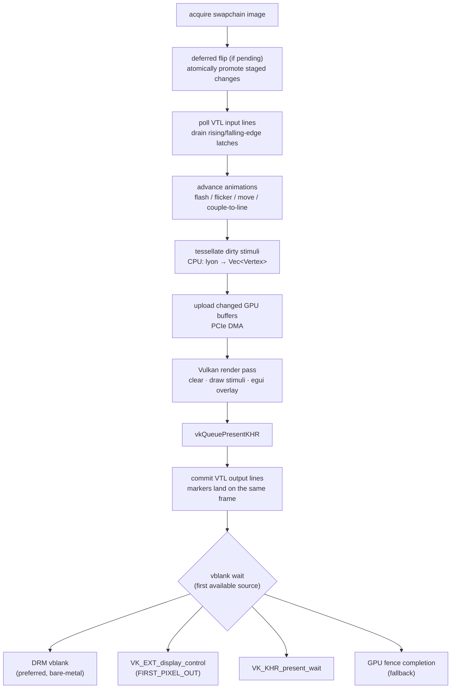

# Architecture

This page describes vstimd's internal structure — the threading model, the shared
scene state, and the per-frame render loop. It is aimed at contributors working on
the server itself. If you only want to *drive* vstimd from a client, see the
[tutorials](../tutorials/index.md) and the [Python client](../client/python.md)
instead.

## Overview

vstimd has a client–server architecture. The server owns the display and renders
stimuli; clients connect over TCP and send commands using
[protobuf](protocol.md) over ZMQ.

## Threads

Two threads share `Arc<RwLock<SceneState>>`:

| Thread | Role |
|---|---|
| **Render** (main thread) | Vulkan render loop, vsync-locked. Holds the write lock once per frame for tessellation, then the read lock for draw. |
| **ZMQ server** (background) | Accepts client connections, decodes protobuf requests, calls `SceneState::handle_request`, encodes responses. Holds the write lock for the duration of one command. |

The `RwLock` write lock is dropped before the render pass begins, so the ZMQ thread
always has a window to process commands between frames.

!!! note "Two hard rules"
    - The render thread must **never block or heap-allocate** on event emission.
    - The write lock (tessellation) is always released before the render thread
      acquires the read lock (draw), guaranteeing ZMQ a window every frame.

## Rendering backends

| Backend | When | Surface |
|---|---|---|
| **DRM/console** | Linux, no display server | `VK_KHR_display` — direct KMS/DRM, no compositor |
| **Desktop** | Linux with X11/Wayland, or Windows | `VK_KHR_surface` via ash-window + winit |
| **Null** | `--null` flag (or `VSTIMD_NULL=1`) | No display, ZMQ server only |

Auto-detection checks the `DISPLAY` / `WAYLAND_DISPLAY` environment variables at
startup. See [Rendering & DRM internals](rendering.md) for the backend module layout
and the vblank-source selection logic.

## Render loop (per frame)

The order of the VTL poll → animation advance → output commit steps is the "frame
contract" that makes on-device reactions frame-accurate — see
[Frame timing](frame-timing.md).

## Scene state

`SceneState` holds all stimulus data and is the only shared mutable state between
threads. Stimuli are stored as a flat `IndexMap<u32, Stimulus>` where the key is the
server-assigned handle returned to the client on creation.

Each stimulus is a variant of the `Stimulus` enum — no trait objects, no heap
allocation per stimulus. Shared fields (position, colour, enabled flag) are held in
component structs (`Transform2D`, `ShapeAppearance`, `StimulusFlags`) composed into
each variant.

!!! info "Design decisions"
    - **Stimulus types** are a flat `enum` with composition — not trait objects or
      inheritance.
    - **2-D and 3-D coexist** in one frame: 3-D is rendered first, 2-D overlaid.
    - **`lib.rs`** exposes all modules as a library crate so integration tests in
      `server/tests/` can call `SceneState::handle_request` directly, without a GPU
      or ZMQ.

## Where to go next

- **[Rendering & DRM internals](rendering.md)** — backend modules, Vulkan setup, and
  the vblank-source chain.
- **[Wire protocol](protocol.md)** — the protobuf request/response envelope.
- **[Server API](server-api.md)** — key Rust types and `cargo doc`.
