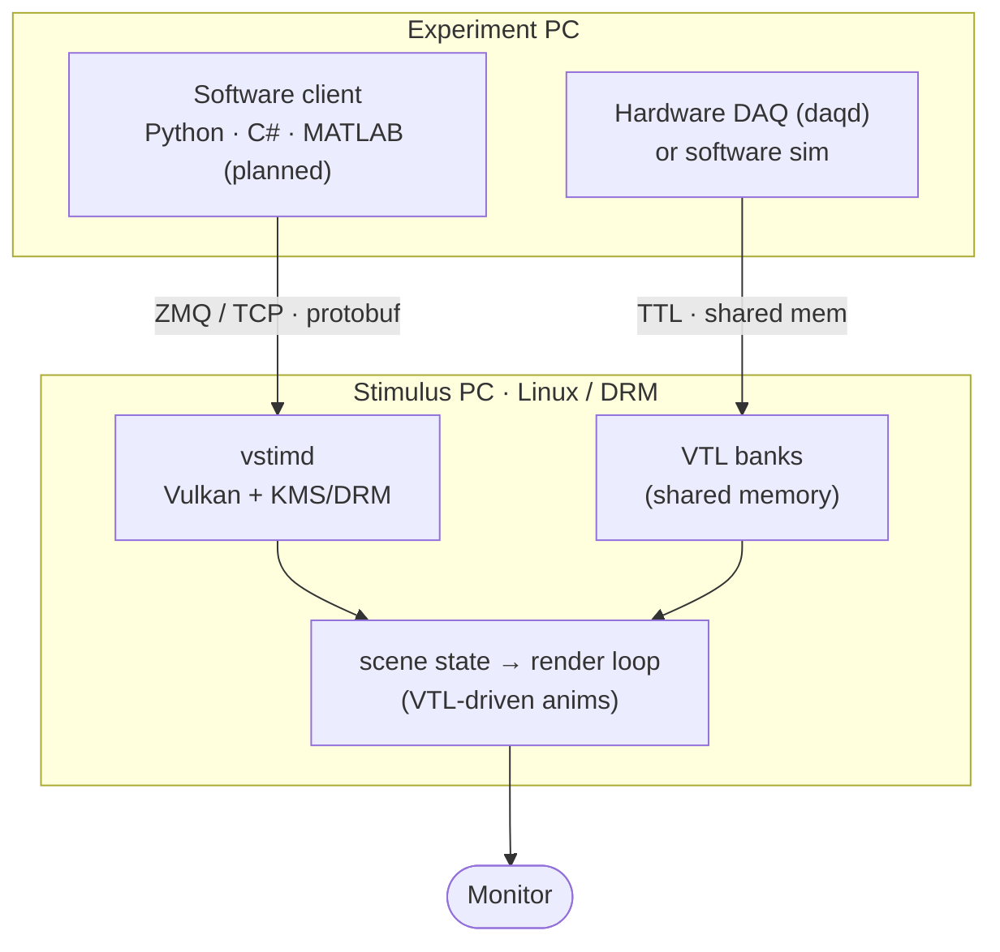
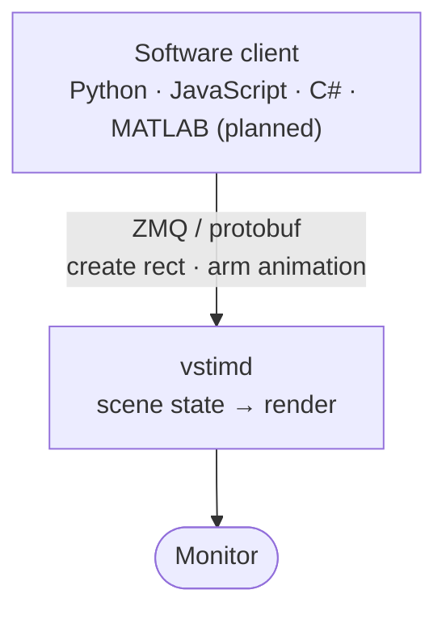
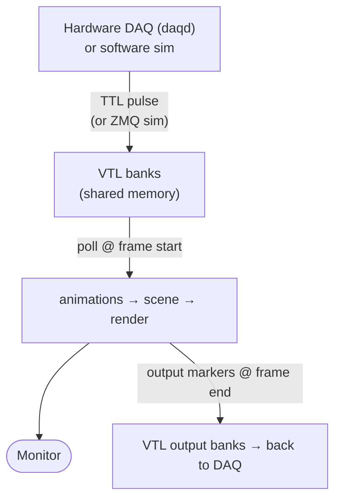

# { width="240" }{ width="240" }

!!! danger "Alpha software — not ready for production"
    vstimd is in **early alpha**. The APIs, wire protocol, and behaviour can change at
    any time, features are incomplete, and it has **not** been validated for experiments
    or data collection. Use it for evaluation and development only — **do not rely on it
    in production yet**.

**vstimd** is a visual stimulus server for neuroscience experiments — a
[daemon](https://en.wikipedia.org/wiki/Daemon_%28computing%29), a background process with no
user interface of its own, which is what the trailing **d** in the name stands for. It runs
on dedicated hardware and accepts commands from experiment scripts over the network,
rendering stimuli with precise, vsync-locked frame timing.

vstimd is a **trigger-driven** stimulus engine. You *set up* a scene ahead of time —
stimuli plus small on-device **animations** — using the **command API**
([ZMQ](https://zeromq.org/)/[protobuf](https://protobuf.dev/), from Python or JavaScript)
or by uploading a **config file**. The device then produces precisely-timed visual
stimulation the moment a **Virtual Trigger Line (VTL)** fires, fed by a hardware DAQ or a
software simulator — the whole timing-critical path stays on the device. This
trigger-driven core, rather than a command-per-frame loop, is what sets vstimd apart from
conventional command-based stimulus software.

!!! tip "New here? Start with these"
    - **[Why vstimd?](why-vstimd.md)** — what a dedicated timing device buys you over
      PsychoPy / Psychtoolbox / MWorks, and how it fuses with ephys and imaging.
    - **[How vstimd works](concepts/how-vstimd-works.md)** — how setup (command / config APIs) and
      trigger-driven execution fit together.
    - **[Stimuli](stimuli/index.md)** — every stimulus type vstimd can draw, and
      what each of its parameters means.
    - **[Build the demos yourself](tutorials/index.md)** — hands-on tutorials that
      rebuild each shipped demo scene, script by script.



## Setup, then triggers

vstimd separates **setup** from **execution**. First you prepare the scene — stimuli and
trigger-armed animations — with one of the **setup APIs**. Then the on-device **trigger
framework** runs the timing-critical moment when a Virtual Trigger Line fires. Setup is a
convenient, network-bound conversation; execution is frame-accurate and stays on the box.

**Setup — the command API (imperative).** A software client sends commands over
ZMQ/protobuf that take effect on the next frame: create a stimulus, set its position,
create an animation armed on a trigger line. Reachable from any protobuf/ZMQ language;
the maintained clients are Python and JavaScript (the web UI), with C# / Bonsai and a
planned MATLAB client.



**Setup — the config API (declarative).** Instead of scripting the scene, upload a
**versioned JSON config file** (stimuli, animations, background, and the VTL line map).
A rig can boot straight into a known configuration with no client connected. See
[Saving & loading scenes](concepts/saving-loading.md).

**Execution — VTL-driven animations (the core).** *Virtual Trigger Lines* (VTL) are a bank
of trigger bits in POSIX shared memory. A hardware bridge (e.g. `daqd`) maps real TTL
lines onto them — or a software client simulates lines over ZMQ. vstimd polls them once
per frame with zero syscall overhead, and the **animations** you armed during setup react
to edges/levels to drive stimulus visibility, position, and output markers in hardware
time — no round-trip back to the experiment PC. This is what vstimd is *for*.



Animations are declarative (flash for N frames, couple visibility to a line, move along a
path, …) and carry a rich start/final/cancel action vocabulary. Because vstimd both reads
input lines and writes output lines each frame, animations can even **chain each other
entirely inside the server**, staying synchronised to the display and to DAQ markers.

## Key features

- **Frame-accurate stimulus timing** — vsync-locked render loop, DRM vblank wait
- **Cross-language clients** — Python, MATLAB *(planned)*, C# (and PsychoPy-compatible Python layer)
- **Bare-metal Linux rendering** — runs without a compositor (X11/Wayland) via [KMS/DRM](https://en.wikipedia.org/wiki/Direct_Rendering_Manager)
- **Deferred mode** — batch multiple stimulus changes into a single atomic frame flip
- **Virtual Trigger Lines (VTL)** — hardware TTL / software triggers via shared memory drive frame-accurate, trigger-reactive animations with no DAQ code inside vstimd
- **Live on-device overlay** — frame timing, stimulus list, animations, VTL state, and command log across F1–F7 panels

## Stimulus types

| Type | Description |
|---|---|
| Rectangle | Axis-aligned filled rectangle with optional outline |
| Circle | Filled circle |
| Ellipse | Filled ellipse |
| Grating | Analytical sinusoidal grating with aperture masks and drift |
| Text | Rendered text with configurable font, size, colour, and anchor |

## Driving it from a client

=== "Python"

    ```python
    from vstimd import Connection
    from vstimd.stimuli import Color, RectParams, ShapeAppearance, Vec2

    with Connection("tcp://stimulus-pc:5555") as conn:
        h = conn.stimuli.shapes.create_rect(
            position_px=Vec2(0, 0),
            params=RectParams(
                width_px=200,
                height_px=100,
                appearance=ShapeAppearance(fill_color=Color(1.0, 0.0, 0.0)),
            ),
        )
        conn.stimuli.set_enabled(h, True)
        conn.stimuli.delete(h)
    ```

=== "PsychoPy"

    ```python
    from vstimd.psychopy import visual

    win = visual.Window(address="tcp://stimulus-pc:5555")
    rect = visual.Rect(win, width=0.5, height=0.25, fillColor="red")
    rect.draw()
    win.flip()
    ```

=== "MATLAB (planned)"

    !!! note "The MATLAB client is planned — it does not exist yet."

    ```matlab
    conn = vstimd.Connection('tcp://stimulus-pc:5555');
    h = conn.stimuli.create_rect('x', 0, 'y', 0, 'width', 200, 'height', 100, ...
                                 'r', 1.0, 'g', 0.0, 'b', 0.0);
    conn.stimuli.set_enabled(h, true);
    conn.stimuli.delete(h);
    conn.close();
    ```
