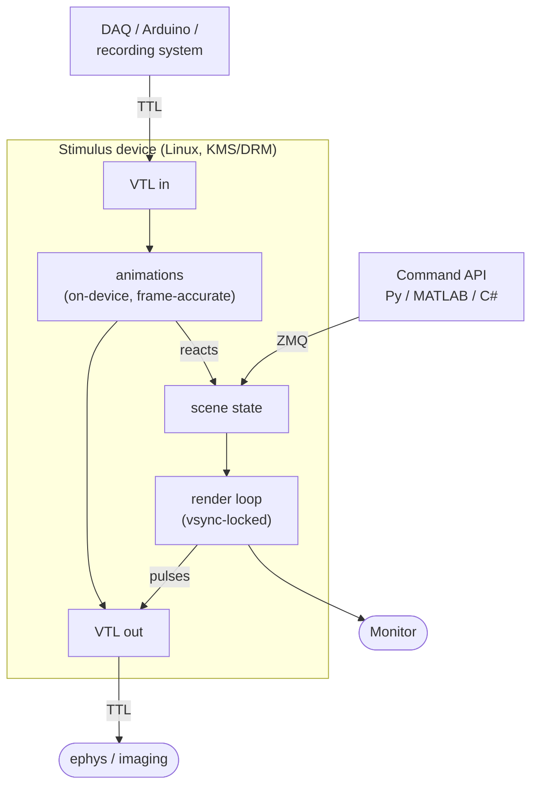

# Choosing an API path

WIP

vstimd is driven along **two complementary paths**. They are not competing
alternatives — most real experiments use both. Understanding *what each path is
for* is the single most important thing to get right, so this page covers it
before any code.

## Path 1 — The command API (imperative)

A software client sends **commands** over ZMQ/protobuf. Each command maps to one
scene change and takes effect on the next frame: *create a rectangle*, *set its
position*, *enable it*, *set the background*, *query server info*.

This is the path you reach for to:

- **build and configure the scene** — create stimuli, set colours, sizes,
  positions, gratings, text;
- **run the high-level experiment structure** — trial loops, condition selection,
  logging, anything driven by your own code;
- **make coordinated changes atomic** — batch several updates so they appear on
  the *same* frame ([deferred mode](../concepts/deferred-mode.md)).

The command API is a **request/response** conversation: every call is a network
round-trip. That is perfect for setup and for events whose timing is set by your
task logic (which are typically many milliseconds apart anyway). It is *not* the
right tool for reacting to an external signal within a single frame — that round
trip through your OS and the network is exactly the jitter you want to avoid.

👉 **[Tutorial: The command API](command-api.md)**

## Path 2 — Triggers & animations via VTL (reactive)

For anything that must happen **in hardware time**, vstimd runs the logic *on the
device itself*.

- **Virtual Trigger Lines (VTL)** are a bank of trigger bits in shared memory. A
  companion daemon maps real TTL lines onto them (or a client simulates them for
  testing).
- **Animations** are small declarative behaviours you upload ahead of time — *flash
  for N frames*, *couple visibility to a line*, *move along a path*, *flicker* — each
  with a rich vocabulary of start/final/cancel actions.

vstimd polls the input lines at the **start of every frame** and commits output
lines at vblank. So an animation can wait for a rising edge on an input line, flash
a stimulus for exactly 10 frames, and pulse an output marker on the frame the flash
begins — all without a single network round-trip. Because vstimd reads *and* writes
lines each frame, animations can even **chain each other entirely inside the
server**.

Reach for this path when:

- the reaction must be **frame-accurate and independent of network/OS latency**;
- you need to **emit stimulus-onset markers** to a recording system;
- you want stimulus behaviour to **react to a TTL, photodiode, or lever** directly.

👉 **[Tutorial: Triggers & animations](vtl-and-animations.md)**

## How the two fit together

A typical trial:

1. **Command API (setup).** Your script creates the stimuli and an animation
   *armed* to fire on a trigger line, then arms it.
2. **VTL (execution).** A TTL from the recording system fires. On that frame vstimd
   flashes the stimulus and pulses an output marker — in hardware time.
3. **Command API (bookkeeping).** Your script queries state, logs the trial, and
   sets up the next one.

The slow, convenient path builds the scene; the fast, on-device path runs the
timing-critical moment. See
[Integrating recording systems](recording-integration.md) for how the output
markers land in your ephys/imaging clock.

## A third path: configuration files

Whole scenes — stimuli, animations, background, **and** the VTL line map — can be
saved to and loaded from **versioned JSON config files** on the device (via the
command API's `config` namespace, or the web UI). This lets a rig boot into a known
stimulus configuration with no client connected at all. See
[Saving & loading scenes](../concepts/saving-loading.md).

## Decision guide

| You want to… | Use |
|---|---|
| Create / modify / query stimuli from your script | **Command API** |
| Run trial logic, condition selection, logging | **Command API** |
| Make several changes appear on one frame | **Command API** + [deferred mode](../concepts/deferred-mode.md) |
| Flash / move / flicker a stimulus with exact frame timing | **Animation** (VTL path) |
| React to a TTL / photodiode / lever within a frame | **Animation armed on a VTL input line** |
| Emit a stimulus-onset marker to ephys/imaging | **Animation with an output trigger-line action** |
| Chain one reaction into another on-device | **Animations coupled via VTL output edges** |
| Boot a rig into a fixed scene with no client | **Config file** |
| Port existing PsychoPy code with minimal edits | **[PsychoPy-compatible layer](command-api.md#psychopy-compatibility)** |
